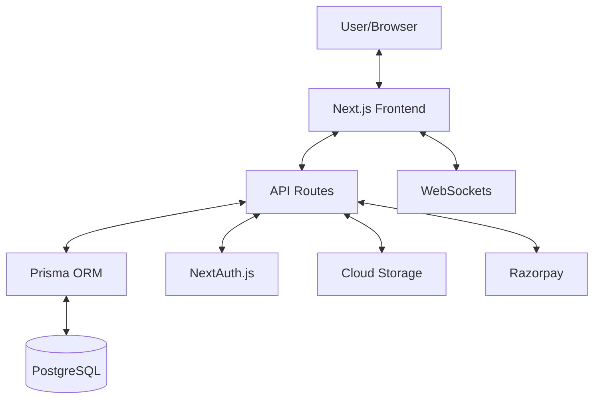
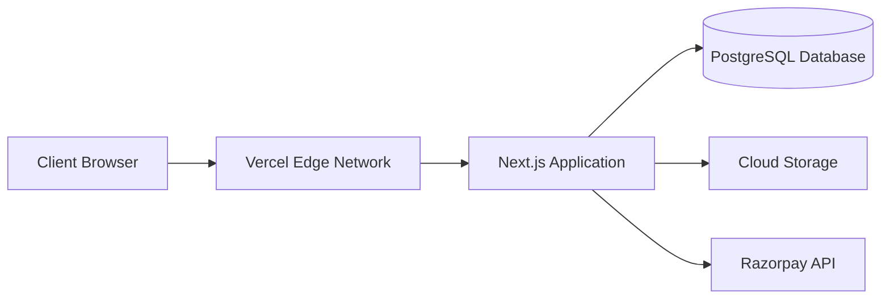

# Design Document

## Overview

Chitrakosha is an artwork marketplace built with Next.js, Prisma, PostgreSQL, and shadcn/ui components. The platform enables artists to showcase and sell their artwork while providing art enthusiasts with a seamless browsing and purchasing experience. This document outlines the technical design and architecture decisions for implementing the complete marketplace.

## Architecture

### Frontend Architecture

The application follows Next.js App Router architecture with the following key components:

1. **Page Components**: React components that represent full pages in the application
2. **Layout Components**: Components that provide consistent structure across multiple pages
3. **UI Components**: Reusable shadcn/ui components for consistent design language
4. **Client Components**: Components marked with 'use client' for client-side interactivity
5. **Server Components**: Components that run on the server for improved performance and SEO

### Backend Architecture

The backend architecture consists of:

1. **API Routes**: Next.js API routes for handling data operations
2. **Database Layer**: Prisma ORM for type-safe database access
3. **Authentication**: NextAuth.js for user authentication and session management
4. **Storage**: Cloud storage for artwork images
5. **Payment Gateway**: Razorpay integration for payment processing
6. **Real-time Updates**: WebSocket integration for auction bidding

### Data Flow

## Components and Interfaces

### Core Components

1. **Authentication Components**
   - SignupForm: Enhanced form with validation
   - LoginForm: Secure login with error handling
   - ProfileEditor: User profile management

2. **Artist Dashboard Components**
   - ArtworkForm: Create/edit artwork with image upload
   - ArtworkList: Display and manage artist's artworks
   - AuctionCreator: Set up artwork auctions
   - StatisticsPanel: Display sales and performance metrics

3. **Marketplace Components**
   - ArtworkGrid: Display artworks with filtering
   - ArtworkDetail: Detailed view of individual artwork
   - SearchBar: Search functionality with filters
   - FilterPanel: Advanced filtering options

4. **Auction Components**
   - AuctionDetail: Display auction information
   - BidForm: Place bids on auctions
   - CountdownTimer: Real-time auction countdown
   - BidHistory: List of previous bids

5. **Community Components**
   - CommunityList: Browse available communities
   - CommunityDetail: View community information
   - PostCreator: Create posts within communities
   - CommentSection: Add and view comments

6. **Payment Components**
   - CheckoutForm: Process payment information
   - OrderSummary: Display order details
   - PaymentStatus: Show payment processing status

### API Interfaces

1. **Authentication API**
   - POST /api/auth/signup: Create new user
   - POST /api/auth/[...nextauth]: NextAuth.js authentication endpoints

2. **User API**
   - GET /api/users/[userId]: Get user profile
   - PUT /api/users/[userId]: Update user profile
   - POST /api/users/artist-application: Submit artist application
   - GET /api/users/artist-application/[userId]: Get application status

3. **Artwork API**
   - GET /api/artworks: List artworks with filtering
   - GET /api/artworks/[artworkId]: Get artwork details
   - POST /api/artworks: Create new artwork
   - PUT /api/artworks/[artworkId]: Update artwork
   - DELETE /api/artworks/[artworkId]: Delete artwork
   - POST /api/artworks/upload: Upload artwork images

4. **Auction API**
   - GET /api/auctions: List active auctions
   - GET /api/auctions/[auctionId]: Get auction details
   - POST /api/auctions: Create new auction
   - POST /api/auctions/[auctionId]/bid: Place bid on auction
   - GET /api/auctions/[auctionId]/bids: Get auction bid history

5. **Order API**
   - POST /api/orders: Create new order
   - GET /api/orders/[orderId]: Get order details
   - GET /api/orders/user/[userId]: Get user's orders

6. **Payment API**
   - POST /api/payment/create-order: Create Razorpay order
   - POST /api/payment/verify: Verify payment
   - POST /api/payment-webhook: Handle Razorpay webhooks

7. **Community API**
   - GET /api/communities: List communities
   - GET /api/communities/[communityId]: Get community details
   - POST /api/communities: Create new community
   - POST /api/communities/[communityId]/join: Join community
   - POST /api/communities/[communityId]/leave: Leave community
   - POST /api/communities/[communityId]/posts: Create post
   - GET /api/communities/[communityId]/posts: Get community posts
   - POST /api/posts/[postId]/comments: Add comment to post

## Data Models

The data models are already well-defined in the Prisma schema. Key models include:

1. **User**: Core user information with authentication details
2. **Artwork**: Artwork details including price and status
3. **Auction**: Auction information linked to artwork
4. **Bid**: Individual bids on auctions
5. **Order**: Purchase orders for artworks
6. **Community**: Art communities
7. **Post**: User posts within communities
8. **Comment**: Comments on posts
9. **ArtistApplication**: Applications for artist status

## Error Handling

The application will implement a comprehensive error handling strategy:

1. **Frontend Error Handling**
   - Form validation with real-time feedback
   - Error boundaries for component-level errors
   - Toast notifications for user feedback
   - Loading states for asynchronous operations

2. **API Error Handling**
   - Consistent error response format
   - HTTP status codes for different error types
   - Detailed error messages for debugging
   - Error logging for monitoring

3. **Database Error Handling**
   - Transaction management for multi-step operations
   - Constraint handling for data integrity
   - Retry mechanisms for transient errors

4. **Authentication Error Handling**
   - Clear messaging for authentication failures
   - Rate limiting for security
   - Session expiration handling

## Testing Strategy

The application will be tested at multiple levels:

1. **Unit Testing**
   - Component tests with React Testing Library
   - API route tests with Jest
   - Utility function tests

2. **Integration Testing**
   - API integration tests
   - Database operation tests
   - Authentication flow tests

3. **End-to-End Testing**
   - User journey tests with Playwright
   - Payment flow tests with mocked payment gateway
   - Responsive design tests across devices

4. **Performance Testing**
   - Load time optimization
   - Database query performance
   - API response time

## Security Considerations

1. **Authentication Security**
   - Secure password hashing with bcrypt
   - CSRF protection
   - Rate limiting for login attempts
   - Secure session management

2. **Data Security**
   - Input validation and sanitization
   - Protection against SQL injection via Prisma
   - XSS protection

3. **Payment Security**
   - PCI compliance via Razorpay
   - Secure webhook handling
   - Payment verification

4. **Image Security**
   - Secure upload process
   - Image validation and sanitization
   - Access control for private images

## Deployment Architecture

The application will be deployed on Vercel, which provides:
- Global CDN for static assets
- Serverless functions for API routes
- Preview deployments for testing
- Environment variable management

## Performance Optimization

1. **Frontend Optimization**
   - Image optimization with Next.js Image component
   - Code splitting and lazy loading
   - Static generation where appropriate
   - Client-side caching

2. **Backend Optimization**
   - Database indexing for frequent queries
   - Connection pooling
   - Caching for expensive operations
   - Optimized API responses

3. **Network Optimization**
   - API response compression
   - Minimized payload sizes
   - Efficient data fetching patterns

## Accessibility Considerations

1. **Semantic HTML** for proper screen reader support
2. **ARIA attributes** where necessary
3. **Keyboard navigation** support
4. **Color contrast** compliance
5. **Responsive design** for all device sizes
6. **Focus management** for interactive elements
7. **Alternative text** for images

## Internationalization

While the initial focus is on the Indian market, the application will be designed with internationalization in mind:
- Text extraction for future translation
- Currency formatting
- Date/time formatting
- Right-to-left layout support